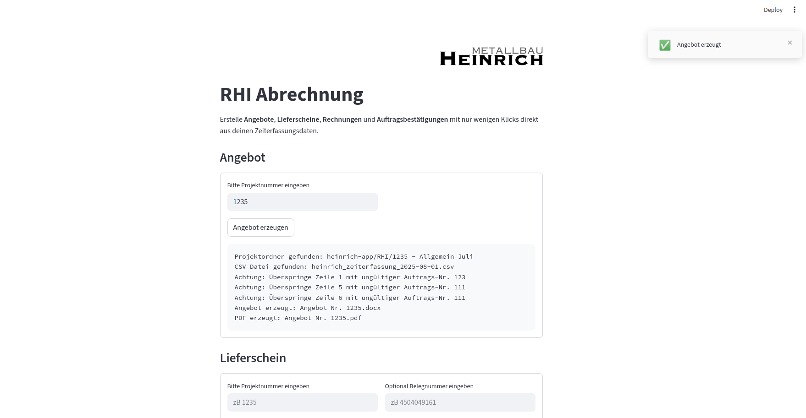

# Automatisierung des Rechnungsprozesses für Heinrich Metallbau

Dieses Tool wurde für Heinrich Metallbau entwickelt, um die manuelle Erstellung von Angeboten, Lieferscheinen, Auftragsbestätigungen und Rechnungen zu automatisieren. Es ist als lokale Streamlit-Webapp sowie als CLI-Tool nutzbar. Grundlage sind CSV-Exporte aus der bestehenden Zeiterfassungssoftware des Kunden, die automatisch verarbeitet und in ein vorhandenes Word-Template übertragen werden. Das Tool ist auf den Abrechnungsprozess mit dem Großkunden RHI ausgerichtet.

**Hinweis:** Das Tool befindet sich bis Ende 2026 im produktiven Einsatz. Ab 2027 wechselt der Kunde auf eine kommerzielle Lösung, die u. a. die Erstellung von E-Rechnungen (XRechnung/ZUGFeRD) unterstützt. Eine Weiterentwicklung dieses Projekts ist daher nicht geplant.

---

Die Benutzeroberfläche ist bewusst einfach gehalten: Projektnummer eingeben, Dokument erzeugen.




---

## 1. Python Installation (Windows)

Für die Nutzung des Tools wird Python 3.12.6 benötigt. Empfohlen wird die Installation über den offiziellen Python-Installer.

1. Öffne die offizielle Python-Website:
   [https://www.python.org](https://www.python.org)

2. Klicke auf **Downloads** und lade die richtige Python-Version für Windows herunter (Python 3.12.6).

3. Starte den Installer.
   **Wichtig:** Aktiviere im ersten Dialog die Option
   **“Add Python to PATH”**.

4. Klicke auf **Install Now** und schließe die Installation ab.

5. Öffne anschließend eine neue PowerShell.

6. Installation prüfen:
   `python --version`
   oder alternativ:
   `py --version`

Wenn eine Versionsnummer angezeigt wird, ist Python korrekt installiert.

---

## 2. Git Installation (Windows)

Git wird benötigt, um das Tool herunterzuladen und Updates zu beziehen.

1. Öffne die offizielle Git-Website:
   [https://git-scm.com](https://git-scm.com)

2. Klicke auf **Download for Windows** und lade den Installer herunter.

3. Starte den Installer und bestätige die Standardeinstellungen.
   Es sind keine speziellen Anpassungen erforderlich.

4. Nach der Installation ein neues Terminal öffnen (PowerShell oder Eingabeaufforderung).

5. Installation prüfen:
   `git --version`

Wenn eine Versionsnummer angezeigt wird, ist Git korrekt installiert und einsatzbereit.

---

## 3. Download der App via Git

1. Klicke oben rechts auf den grünen Button **Code** und kopiere die **HTTPS-URL** des Repos.

2. Öffne ein Terminal
   (z. B. PowerShell unter Windows).

3. Navigiere in den Ordner, in dem das Tool gespeichert werden soll:


```
cd path/to/folder/
```

4. Repo klonen:


```
git clone https://github.com/USER/heinrich-app.git
```


Das Projekt befindet sich nun im neu erstellten Ordner `heinrich-app`.

Hinweis:
Für das reine Klonen eines öffentlichen Repositories ist kein GitHub-Account und kein SSH-Key erforderlich.

5. Updates abrufen

Mit folgendem Befehl werden Änderungen aus dem GitHub-Repository in den lokalen Projektordner übernommen:

```
git pull
```

---

## 4. Konfiguration


Für die Nutzung des Tools werden zwei weitere Dateien benötigt, die sich nicht im Repository befinden:

- `Vordruck.docx` (Word-Template für alle Outputdokumente)
- `config.json` (Konfigurationsdatei mit Stundenlohn, Mehrwertsteuersatz etc.)

Diese erhält der Nutzer des Tools per Mail. Für die korrekte Nutzung:

1. `Vordruck.docx` → Ordner `templates`
2. `config.json` → Heinrich App Projektordner (Root-Ebene)
3. In `config.json` den Pfad zum Datenverzeichnis konfigurieren: `"DATA_ROOT": "/Pfad/zu/RHI/"`

---

## 5. Nutzung als App (Windows)

Das Tool kann unter Windows als lokale Web-App genutzt werden, die per Doppelklick gestartet wird.

### Einrichtung

1. Erstelle eine **Desktopverknüpfung** der Datei `scripts/app_windows.vbs`
2. Rechtsklick auf die Verknüpfung → **Eigenschaften**
3. Reiter **Verknüpfung** → **Anderes Symbol…**
4. Wähle die Datei `assets/icon.ico`
5. Fertig

### Nutzung

* Ein Doppelklick auf die Desktopverknüpfung installiert bei erster Nutzung die notwendigen Packages in einer Virtuellen Umgebung. (Dies kann eine Weile dauern). Dann startet die Heinrich App.
* Die App öffnet sich automatisch im Standardbrowser.
* Ist die App bereits geöffnet, wird lediglich ein weiterer Browser-Tab geöffnet.

---

## 6. Nutzung als CLI-Tool

Als CLI-Tool wird das Programm im Projektordner über die Kommandozeile gestartet.

Voraussetzungen:
* Virtuelle Umgebung: `python -m venv .venv`
* Installierte Abhängigkeiten: `pip install -r requirements.txt`

### Angebot erzeugen

```
python cli.py --mode offer --project-number 1235
```
or short
```
python cli.py -m offer -p 1235
```

---

### Lieferschein erzeugen

```
python cli.py --mode delivery --project-number 1235
```
oder kurz
```
python cli.py -m delivery -p 1235
```
oder mit optionaler Belegnummer
```
python cli.py -m delivery -p 1235 -r 4504049161
```


---

### Rechnung & Auftragsbestätigung erzeugen

```
python cli.py --mode invoice --project-number 1235 --receipt-number 4504049161
```
oder kurz
```
python cli.py -m invoice -p 1235 -r 4504049161
```

---

## 7. Dokumenten-Workflows

Das Tool arbeitet mit klar getrennten Modi. Jeder Modus entspricht einem eigenen Verarbeitungspfad und einem definierten Ergebnis.

Zentral ist ein **zweistufiger Prozess**:

1. Erzeugung eines Angebots oder Lieferscheins inklusive Tabellenbefüllung und Berechnung
2. Ableitung von Rechnung und Auftragsbestätigung aus einem gespeicherten Zwischenstand

---

### Modus `offer` oder `delivery` – Angebot oder Lieferschein erzeugen

**Eingaben**

* `project_number`
* Optional: `receipt_number` (für delivery mode)
* Zeiterfassungs-CSV im Projektordner (automatisch erkannt anhand `project_number`)

**Ablauf**

1. Die CSV-Datei des Projekts wird eingelesen (neueste Datei).
2. Die CSV-Zeilen werden in strukturierte Positionen (Line Items) umgewandelt.
3. Die originale Word-Vorlage (`Vordruck.docx`) wird geladen.
4. Die Positionstabelle wird mit den Line Items befüllt.
5. Ein Teil der Platzhalter wird gesetzt (z. B. Summen, Termine).
6. Ein **Intermediate Template** wird gespeichert.
7. Die restlichen Angebots- oder Lieferschein-Platzhalter werden gesetzt.
8. Das finale Dokument wird als DOCX gespeichert.
9. Zusätzlich wird eine PDF-Version erzeugt.

**Ergebnisse**

* `Angebot/Lieferschein Nr. <project_number>.docx`
* `Angebot/Lieferschein Nr. <project_number>.pdf`
* Intermediate Template (intern, Grundlage für weitere Dokumente)

---

### Modus `invoice` – Rechnung und Auftragsbestätigung erzeugen

**Eingaben**

* `project_number`
* `receipt_number`
* zuvor erzeugtes Intermediate Template (automatisch erkannt anhand `project_number`)

**Ablauf**

1. Das Intermediate Template wird geladen.
2. Es werden zwei unabhängige Kopien des Dokuments erzeugt.
3. In Kopie A werden die Rechnung-Platzhalter gesetzt.
4. In Kopie B werden die Auftragsbestätigungs-Platzhalter gesetzt.
5. Beide Dokumente werden als DOCX gespeichert.
6. Beide Dokumente werden zusätzlich als PDF erzeugt.

**Ergebnisse**

* `Rechnung Nr. <project_number> - <receipt_number>.docx`
* `Rechnung Nr. <project_number> - <receipt_number>.pdf`
* `Auftragsbestätigung Nr. <project_number> - <receipt_number>.docx`
* `Auftragsbestätigung Nr. <project_number> - <receipt_number>.pdf`

---

## 8. Erweiterungsideen

Vor dem Wechsel auf eine kommerzielle Lösung waren folgende Erweiterungen angedacht:

* UI-basierte Erfassung von Positionen zur Erzeugung von kundenspezifischen Angeboten
* Generierung von E-Rechnungen (z.B. XRechnung / ZUGFeRD)
* Anpassung der Konfigurationsdatei über das UI

---

## 9. Testing

Da das Tool schrittweise entlang einer wachsenden Businesslogik entstanden ist und die Anforderungen zu Beginn nicht vollständig feststanden, wurde auf automatisierte Tests verzichtet. Getestet wurde manuell über das CLI: Dokumente erzeugen und das Ergebnis visuell prüfen.

Folgende Projektnummern eignen sich als Testfälle:

- 1218
- 1223
- 1235
- 1236
- 1253

```
python cli.py -m offer -p 1218
python cli.py -m delivery -p 1218
python cli.py -m delivery -p 1218 -r 4504020708
python cli.py -m invoice -p 1218 -r 4504020708

python cli.py -m offer -p 1223
python cli.py -m delivery -p 1223
python cli.py -m delivery -p 1223 -r 4504030989
python cli.py -m invoice -p 1223 -r 4504030989

python cli.py -m offer -p 1235
python cli.py -m delivery -p 1235
python cli.py -m delivery -p 1235 -r 4504049161
python cli.py -m invoice -p 1235 -r 4504049161

python cli.py -m offer -p 1236
python cli.py -m delivery -p 1236
python cli.py -m delivery -p 1236 -r 4504059903
python cli.py -m invoice -p 1236 -r 4504059903

python cli.py -m offer -p 1253
python cli.py -m delivery -p 1253
python cli.py -m delivery -p 1253 -r 4504072524
python cli.py -m invoice -p 1253 -r 4504072524

```
